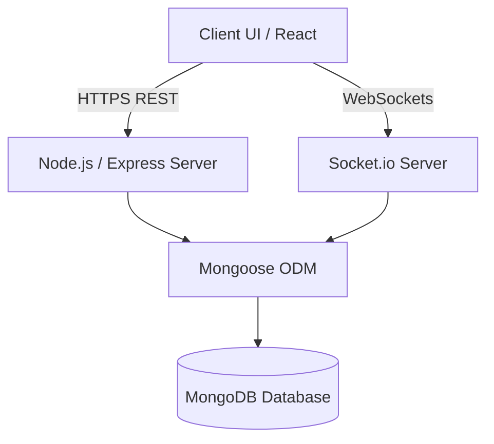

# UniConnect Platform Architecture

UniConnect is a privacy-focused community discussion and social networking platform where users interact through pseudonymous public identities, create and join topic-based communities, participate in threaded discussions, vote on content, discover posts through feeds, and communicate through private real-time messaging.

---

## 1. High-Level Architecture

UniConnect follows a classic three-tier architecture:
- **Client Tier:** React (to be implemented) interacting via REST APIs and WebSockets.
- **Application Tier:** Node.js, Express.js web server handling routing, business logic, authorization, and WebSocket event handling.
- **Database Tier:** MongoDB persisting documents.

---

## 2. Privacy & Identity Model

To guarantee user privacy, the architecture separates **Private Account Credentials** from **Public Pseudonymous Identities**:

### Private Identity
- MongoDB stores the user's `email`, `password` (hashed with bcrypt), roles, and configuration.
- Private details are **never** returned in public responses. They are restricted to the owner at `/api/users/me` for settings and profile management.

### Public Identity
- Public interactions are bound to a unique public `username`.
- Presentation in public feeds, posts, comments, and messages is formatted as `u/username`.
- Standard user searches and public profile queries `/api/users/:username` only return:
  - `username` (formatted as `u/username`)
  - `avatar` (public URL or null)
  - `bio` (public bio)
  - `karma` (score stats)
  - `createdAt`

---

## 3. Feed & Sorting System

Feeds are dynamically calculated and served via `/api/feed/*` routes:
- **Home Feed:** Aggregates posts from communities the user has joined. If no communities are joined, falls back to the Popular feed.
- **Latest Feed:** Chronological list of posts (`createdAt: -1`).
- **Popular Feed:** Engagement-signal feed sorted by a pre-calculated `hotRank` index.

### Hot Ranking Algorithm
Posts maintain a `hotRank` field that recalculates atomically whenever votes are cast:
$$\text{Score} = \text{upvoteCount} - \text{downvoteCount}$$
$$\text{Sign} = \text{sgn}(\text{Score})$$
$$\text{Order} = \log_{10}(\max(1, |\text{Score}|))$$
$$\text{Seconds} = \text{createdAt.getTime()} / 1000 - 1785984000$$
$$\text{Hot Rank} = \text{Sign} \times \text{Order} + \frac{\text{Seconds}}{45000}$$

This formula guarantees that newly created posts get a baseline boost, while high upvotes keep older content ranked high until decay takes over.

---

## 4. Karma & Voting System

The simple Karma system tracks user contribution quality:
- Upvoting a post/comment adds +1 to the author's post/comment karma.
- Downvoting a post/comment subtracts -1.
- Removing a vote restores the karma value.
- Self-votes on post/comment creation do not trigger duplicate updates.

All vote interactions occur atomically through the Vote model to prevent concurrency count skew.

---

## 5. Real-Time Chat & Prescence

Private communication utilizes WebSockets via **Socket.io** alongside HTTP fallbacks:
- **Socket Authentication:** Restricts connections to valid JWT bearer tokens passed during handshake. Unauthenticated connections are rejected.
- **IDOR Protection:** Conversations require exactly two participants. Sockets verify membership before allowing users to join rooms or send messages.
- **Presence Tracking:** An in-memory presence registry tracks online status dynamically without causing database write congestion.
- **Persistence:** Every message sent via socket or HTTP is stored in MongoDB, updating the conversation's `lastMessage` details.

---

## 6. Moderation Framework

Moderation operates at two distinct levels:
1. **Community Moderators:** Community owners and assigned moderators can delete posts/comments, update community rules, and review reports filed against content within their specific community.
2. **Platform Admins:** Global administrative users have full access to statistics, global reports, and can suspend users or moderate any community space.
